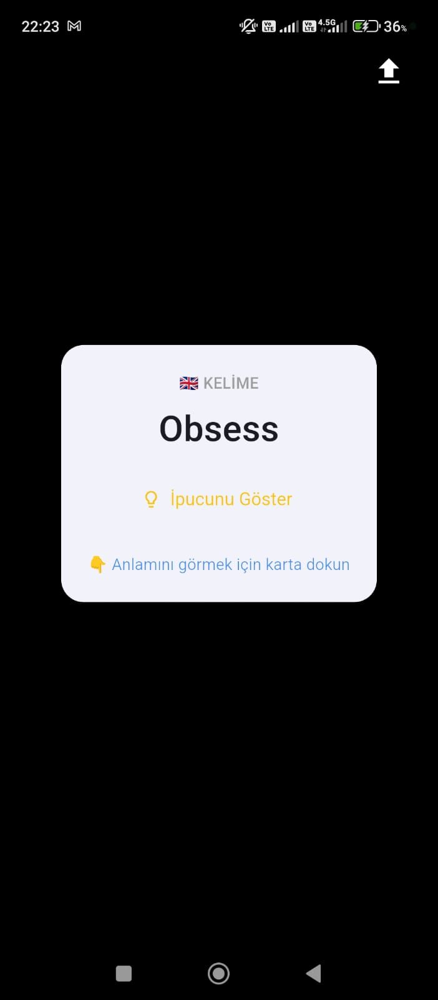
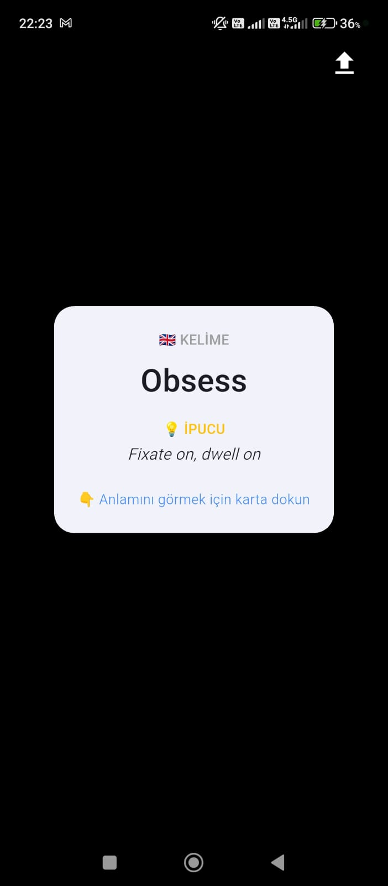
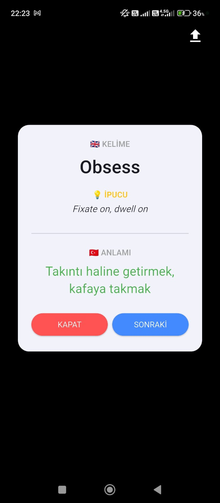

# 📱 VocaHub Lock

> Turn your smartphone addiction into a learning habit! 🧠
> An educational app powered by Flutter and Native Android that teaches you new words every time you unlock your phone (right after passing the lock screen).

VocaHub Lock is an open-source tool that allows users to upload their own **English - Turkish** vocabulary lists (in CSV format). Every time the device is unlocked, a random vocabulary card pops up on the screen, forcing a quick learning session before you proceed.

## 📸 Screenshots

  
  &nbsp;&nbsp;&nbsp;
  
  &nbsp;&nbsp;&nbsp;
  

*(Click on any image to view it in full size)*

## ✨ Features

* **🚀 Instant Trigger:** Intervenes the moment the device is unlocked (`ACTION_SCREEN_ON`) and displays the vocabulary card directly after the password screen.
* **📂 Custom English-Turkish CSV Upload:** Users can upload their own English vocabulary and Turkish meaning pools as a CSV file. Google Drive file picking is supported.
* **⚙️ Native & Flutter Bridge:** Seamless communication between Flutter's modern UI and Kotlin's Native Android services (BroadcastReceiver, Foreground Service).
* **🛡️ Android 15 Ready:** Fully compliant with the latest Android security policies and Foreground Service (`specialUse`) restrictions.

## ⚠️ Critical Permission Settings (Please Read)

For the app to seamlessly pop up after the lock screen, it is **mandatory to manually grant** all the following permissions from your phone's **Settings > Apps > VocaHub Lock** menu (especially for devices with custom UIs like Xiaomi, Redmi, POCO):

1. ✅ **Auto-start:** Ensures the background service runs automatically even if the phone reboots.
2. ✅ **Display over other apps:** The most fundamental permission required to draw the vocabulary card over the home screen.
3. ✅ **Display pop-up windows while running in the background:** Allows the app to wake up and trigger the card while the app is sleeping.
4. ✅ **Display pop-up windows:** Prevents the Android system from blocking the sudden appearance of the card.
5. ✅ **Home screen shortcuts:** Allows seamless transition from the lock screen card directly to the app.

*(It is also highly recommended to set the app's battery saver settings to "No restrictions" to prevent the OS from killing the background service.)*

## 📄 CSV File Format (English - Turkish)

The `.csv` file you create to upload your own words must have the following column structure. The database is designed to extract the English word, its Turkish meaning, and a hint/example sentence:

| English Word (A) | Turkish Meaning (B) | Empty (C) | Empty (D) | Hint / Example Sentence (E) |
| :--- | :--- | :--- | :--- | :--- |
| play | oynamak | bos | bos | oyun oynamak veya bir enstrüman çalmak |
| go | gitmek | bos | bos | bir yere doğru hareket etmek |

## 🛠️ Built With

* **UI:** Flutter / Dart
* **Background Services (Native):** Kotlin / Android SDK
* **Database:** SQLite
* **File Management:** `file_picker` 

## 👨‍💻 Developer

**Fevzi BAĞRIAÇIK** *Computer Engineering Student at Manisa Celal Bayar University*
